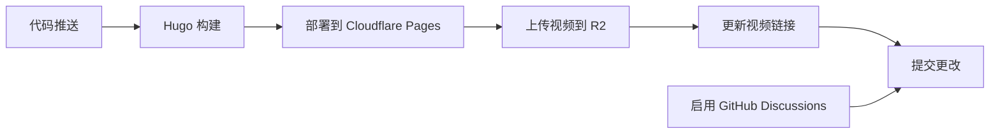

# Hugo 部署指南：牧月记三部曲

本文档详细说明如何使用 Hugo 发布您的学术著作，包括视频资源管理、Cloudflare R2 集成和 GitHub Discussions。

## 🚀 快速开始

### 1. 项目结构设置

```
hugo-site/
├── content/                 # 文章内容
│   ├── tian/               # 天卷
│   │   └── _index.md      # I.md
│   ├── di/                 # 地卷
│   │   ├── _index.md      # II.md
│   │   ├── chapter2.md    # III.md
│   │   └── chapter3.md    # IV.md
│   └── ren/                # 人卷
│       ├── _index.md      # V.md
│       ├── chapter2.md    # VI.md
│       ├── chapter3.md    # VII.md
│       ├── chapter4.md    # VIII.md
│       └── chapter5.md    # IX.md
├── static/videos/          # 视频文件存放目录
├── scripts/               # 自动化脚本
│   ├── upload_videos.sh
│   └── replace_video_links.py
├── layouts/               # Hugo 模板
├── .github/workflows/     # CI/CD 配置
└── config.yaml           # Hugo 配置
```

### 2. 视频资源管理

#### 📁 视频存放位置

将您的视频文件按照以下结构放置：

```
static/videos/
├── tian/                  # 天卷相关视频
│   ├── chapter1_1.mp4
│   └── chapter1_2.webm
├── di/                    # 地卷相关视频
│   ├── chapter2_1.mp4
│   └── chapter3_1.webm
└── ren/                   # 人卷相关视频
    ├── chapter5_1.mp4
    └── chapter6_1.webm
```

#### 📤 视频上传到 Cloudflare R2

1. **配置 R2 密钥**

编辑 `scripts/upload_videos.sh`，填入您的 Cloudflare R2 信息：

```bash
R2_BUCKET="your-bucket-name"
R2_ACCOUNT_ID="your-account-id"
R2_ACCESS_KEY="your-access-key"
R2_SECRET_KEY="your-secret-key"
PUBLIC_DOMAIN="https://your-cdn-domain.com"
```

2. **执行上传**

```bash
# 上传所有视频
./scripts/upload_videos.sh

# 或指定目录
./scripts/upload_videos.sh static/videos/tian
```

3. **自动替换链接**

上传完成后，运行链接替换脚本：

```bash
python3 scripts/replace_video_links.py
```

这将：
- 自动更新所有 Markdown 文件中的视频链接
- 生成 `video_url_mapping.txt` 映射文件
- 创建 `video_embeds.md` 嵌入代码文档

### 3. 本地预览

```bash
# 安装 Hugo（如果尚未安装）
# macOS
brew install hugo

# Ubuntu/Debian
sudo apt-get install hugo

# 或从官网下载：https://gohugo.io/

# 本地预览
hugo server -D

# 访问 http://localhost:1313
```

## 🔄 自动部署流程

### GitHub Actions 设置

1. **配置 Secrets**

在 GitHub 仓库设置中添加以下 Secrets：

| Secret 名称 | 描述 |
|-------------|------|
| `CLOUDFLARE_API_TOKEN` | Cloudflare API 令牌 |
| `CLOUDFLARE_ACCOUNT_ID` | Cloudflare 账户 ID |
| `R2_ACCESS_KEY` | R2 访问密钥 |
| `R2_SECRET_KEY` | R2 密钥 |
| `R2_BUCKET` | R2 存储桶名称 |
| `R2_CDN_DOMAIN` | CDN 域名 |

2. **部署流程**

推送代码到 `main` 分支时，会自动触发：



### Cloudflare Pages 配置

1. **连接仓库**

- 访问 Cloudflare Dashboard
- 选择 Pages → 创建项目
- 连接您的 GitHub 仓库

2. **构建设置**

```
构建命令：hugo --minify
构建输出目录：public
```

3. **自定义域名**

设置您的域名，如：`muyueji.pages.dev`

## 💬 GitHub Discussions 集成

### 配置步骤

1. **启用 Discussions**

在仓库设置中启用 Discussions 功能。

2. **配置 Hugo**

在 `config.yaml` 中添加：

```yaml
params:
  comments:
    enabled: true
    provider: 'github'
  discussions:
    repo: 'your-username/your-repo'
    categoryId: 'general'
```

3. **创建讨论分类**

在 GitHub 仓库中创建讨论分类，如：
- `general` - 一般讨论
- `feedback` - 反馈
- `questions` - 问题

### 使用效果

- 每篇文章底部显示讨论区
- 自动搜索相关讨论
- 支持创建新讨论
- 显示回复数量和更新时间

## 📋 最佳实践

### 1. 内容管理

- **统一命名**：使用数字前缀保持章节顺序
- **标签系统**：为每篇文章添加相关标签
- **摘要描述**：为每篇文章写简短摘要

### 2. 视频优化

- **格式选择**：优先使用 WebM，备选 MP4
- **压缩优化**：控制视频文件大小
- **多分辨率**：考虑提供不同分辨率选项

### 3. SEO 优化

- **元数据**：为每篇文章设置 description 和 keywords
- **图片 ALT**：为图片添加描述性 ALT 文本
- **结构化数据**：考虑添加 JSON-LD 结构化数据

### 4. 性能优化

- **图片优化**：使用 WebP 格式
- **CDN 加速**：利用 Cloudflare CDN
- **懒加载**：为图片和视频启用懒加载

## 🛠 故障排除

### 常见问题

1. **Hugo 构建失败**

```bash
# 检查 Hugo 版本
hugo version

# 查看详细错误
hugo --verbose

# 检查配置文件
hugo config
```

2. **视频上传失败**

```bash
# 检查 AWS CLI 配置
aws configure list

# 测试 R2 连接
aws s3 ls s3://your-bucket --endpoint-url https://your-account.r2.cloudflarestorage.com
```

3. **链接替换不生效**

```bash
# 手动检查映射文件
cat video_url_mapping.txt

# 调试运行替换脚本
python3 scripts/replace_video_links.py --verbose
```

### 日志查看

- **GitHub Actions**：查看 Actions 标签页的执行日志
- **本地构建**：使用 `hugo server --verbose` 获取详细日志
- **上传脚本**：查看生成的 `uploads_*.log` 文件

## 📞 支持

如需帮助，请：

1. 查看 [Hugo 官方文档](https://gohugo.io/)
2. 检查 [Cloudflare Pages 文档](https://developers.cloudflare.com/pages/)
3. 在 [GitHub Discussions](https://github.com/your-repo/discussions) 中提问

---

**提示**：首次部署可能需要几分钟时间来完成所有设置。建议先在本地测试，确认无误后再推送到仓库触发自动部署。